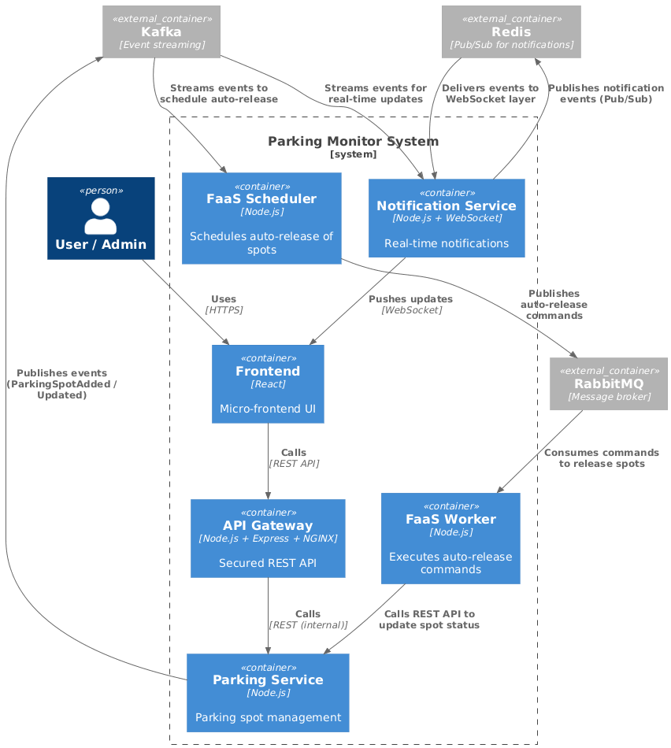
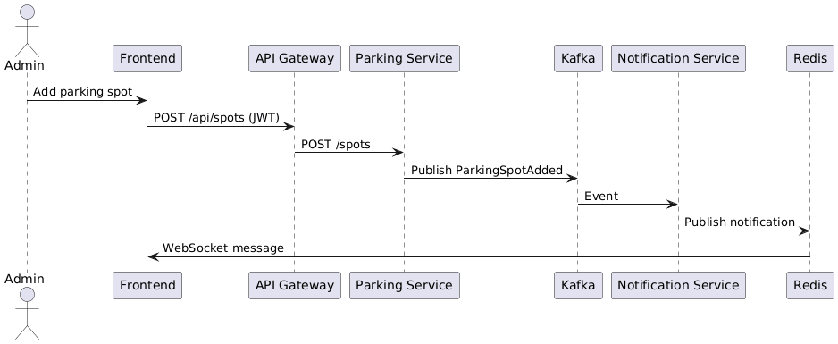

The Parking Monitor System is a microservice-based platform designed to manage and monitor parking spots in real time. It combines REST APIs, event streaming, message brokering, serverless functions, and real-time notifications to provide a scalable and reactive solution.

## Frontend (React + WebSockets)

- Micro-frontend architecture served via HTTP.
- Displays parking spots and their status live.
- Receives real-time notifications from the Notification Service via WebSockets.

## API Gateway (Node.js + Express + NGINX)

- Exposes secured REST endpoints for frontend and internal services.
- Handles authentication, authorization (USER vs ADMIN roles) and routing.

## Parking Service (Node.js)

- Manages parking spot data (create, update, query).
- Publishes parking events to Kafka for event streaming.
- Triggers auto-release tasks via RabbitMQ.

## Notification Service (Node.js + WebSocket + Redis)

- Subscribes to Kafka events.
- Broadcasts real-time updates to connected frontends using a WebSocket server.
- Uses Redis Pub/Sub to fan out messages to multiple WebSocket server instances.

## FaaS Auto-Release (Node.js + RabbitMQ)

- Scheduler: Listens to parking events and schedules auto-release tasks by publishing to RabbitMQ with TTL.
- Worker: Consumes tasks from RabbitMQ, waits for TTL expiration, checks spot status, frees the spot, and publishes a ParkingSpotFreed event to Kafka.
- Enables serverless, event-driven processing without continuous polling.

## Infrastructure & Communication:

- Kafka: Event streaming for parking-related events.
- RabbitMQ: Task queue for delayed auto-release jobs (TTL + DLQ pattern).
- Redis: Real-time message broadcast to multiple WebSocket servers.
- Docker: Containerized services for easy deployment and scalability.
- NGINX: Serves API Gateway and can handle load balancing.

